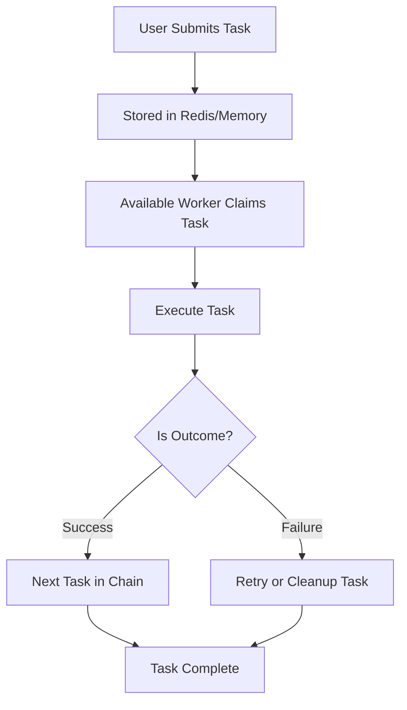
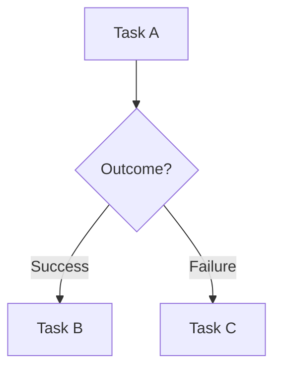

# Skedulr

[](https://pkg.go.dev/github.com/lupppig/skedulr)
[](https://opensource.org/licenses/MIT)

**Skedulr** is a lightweight yet powerful background task scheduler for Go.
It is built for reliability, scalability, and simplicity — ensuring your tasks execute correctly even across restarts or across multiple application instances.

Whether you're building a small service or a distributed system, Skedulr helps you manage background jobs with confidence.

---

## Why Skedulr?

### Reliable Execution

With Redis-backed persistence, tasks survive application restarts. Your scheduler resumes exactly where it left off.

### Horizontal Scaling

Run multiple instances of your application and Skedulr coordinates workers safely using distributed locking — preventing duplicate execution.

### Smart Retries

Failed tasks are retried automatically with configurable retry and backoff strategies.

### Task Dependencies (DAG Support)

Create task chains where jobs run conditionally based on the success or failure of other tasks.

### Built-in Dashboard

Visualize running, completed, and failed tasks in real time.

### Concurrency Control

* Worker pool limits
* Dedicated pools for specific task types
* Unique task keys to prevent overlapping execution

---

## How It Works

Skedulr acts as an intelligent task orchestrator:



1. Tasks are submitted to the scheduler.
2. Tasks are stored (in-memory or Redis).
3. Workers claim and execute tasks.
4. Results determine retries or downstream task execution.

---

## Installation

```bash
go get github.com/lupppig/skedulr
```

---

## Quick Start

Getting started takes only a few lines:

```go
package main

import (
	"context"

	"github.com/lupppig/skedulr"
)

func main() {
	s := skedulr.New(
		skedulr.WithMaxWorkers(5),
	)

	myTask := func(ctx context.Context) error {
		println("I am working!")
		return nil
	}

	s.Submit(skedulr.NewTask(myTask, 1, 0))

	s.ShutDown(context.Background())
}
```

---

## Advanced Workflows (Task Chains)

Skedulr supports Directed Acyclic Graphs (DAGs), allowing conditional execution.



Example:

```go
s.Submit(
	skedulr.NewTask(jobB).
		OnSuccess("task-a"),
)

s.Submit(
	skedulr.NewTask(jobC).
		OnFailure("task-a"),
)
```

This allows you to:

* Run cleanup tasks on failure
* Trigger dependent workflows on success
* Build complex automation pipelines

---

## Features for Production Applications

### Storage Options

* In-memory storage for simple use cases
* Redis-backed persistence for distributed systems

### Custom Worker Pools

Allocate dedicated workers per task category:

* 2 workers for Emails
* 5 workers for Video Processing
* 10 workers for Analytics

### Unique Task Keys

Ensure certain tasks never run concurrently (for example, preventing multiple "Weekly Report" jobs at once).

### Task History

Track execution history and inspect:

* Successes
* Failures
* Retries
* Execution duration

### Web Dashboard

Mount the dashboard to monitor:

* Worker activity
* Queue depth
* Task states
* Retry attempts

---

## When to Use Skedulr

Skedulr is ideal for:

* Background email sending
* Payment verification retries
* Webhook processing
* Report generation
* Media processing
* Distributed microservices task coordination

---

## License

MIT License.
Use it freely in personal and commercial projects.
