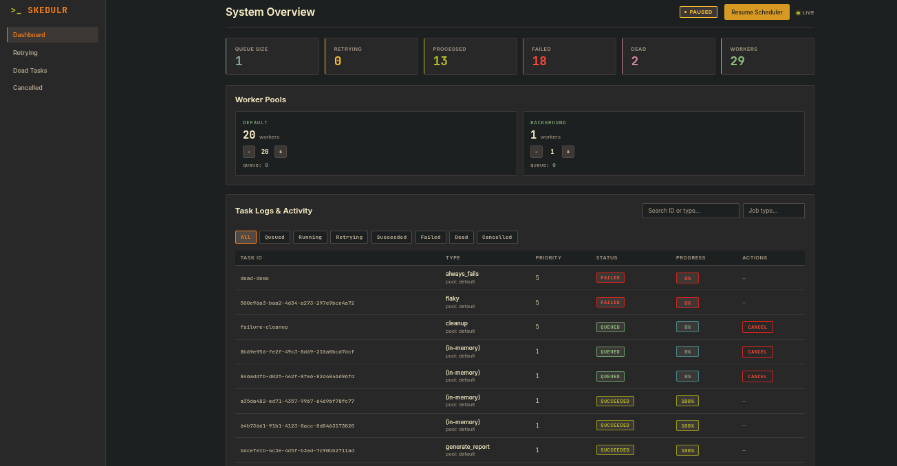

# Skedulr

### Production-grade background task scheduler for Go

[](https://pkg.go.dev/github.com/lupppig/skedulr)
[](https://goreportcard.com/report/github.com/lupppig/skedulr)
[](https://opensource.org/licenses/MIT)

One dependency (Redis), one binary, zero infrastructure. Submit tasks, register handlers, let the scheduler handle persistence, retries, worker pools, and crash recovery.

---

## Quickstart

```bash
go get github.com/lupppig/skedulr
```

```go
s := skedulr.New(
    skedulr.WithRedisStorage("localhost:6379", "", 0),
    skedulr.WithMaxWorkers(10),
)

s.RegisterJob("send_email", func(ctx context.Context) error {
    log.Println("sending email...")
    return nil
})

s.Submit(
    skedulr.NewPersistentTask("send_email", []byte(`{"to":"user@example.com"}`), 10, 0).
        WithPool("critical").
        WithMaxRetries(3).
        WithRetryStrategy(skedulr.NewExponentialBackoff(3, 500*time.Millisecond, 10*time.Second, 0.2)),
)
```

See [`example/example.go`](example/example.go) for a full runnable demo covering every feature.

---

## Architecture

```
┌─────────────────────────────────────────────────────────────────┐
│                          Scheduler                              │
│                                                                 │
│  Submit() ──▶ ┌──────────────┐  dequeueLoop  ┌──────────────┐  │
│               │ Priority     │ ─────────────▶ │ Worker Pools │  │
│               │ Queue (heap) │                │ default      │  │
│               └──────────────┘                │ critical     │  │
│                     ▲                         │ background   │  │
│                     │                         └──────┬───────┘  │
│                     │                                │          │
│  ┌──────────────────┴───────────────┐          runTask()        │
│  │        Timing Wheel              │          middleware       │
│  │  O(1) insert · O(1) cancel       │          chain           │
│  │  1 goroutine · all delays        │                │         │
│  │                                  │          ┌─────▼──────┐  │
│  │  ScheduleOnce()                  │          │  Success    │  │
│  │  ScheduleRecurring()             │          │  Retry      │  │
│  │  ScheduleCron()                  │          │  Dead (DLQ) │  │
│  │  Retry backoff                   │          └─────┬───────┘  │
│  └──────────────────────────────────┘                │         │
│                                              resolveWorkflow() │
│                                              OnSuccess/OnFail  │
├─────────────────────────────────────────────────────────────────┤
│                     Redis (Storage)                             │
│  ZSET queue · ZSET history · ZSET delayed · Lua scripts        │
│  Lease keys · Pub/Sub cancel · Orphan recovery                 │
└─────────────────────────────────────────────────────────────────┘
```

### Source Map

| File | Responsibility |
|---|---|
| `scheduler.go` | Core loop: submit, dequeue, dispatch, worker lifecycle, pause/resume, shutdown |
| `timing_wheel.go` | Hierarchical timing wheel — delay queue, bucket ring, tick loop |
| `storage.go` | `Storage` interface, `RedisStorage` (Lua scripts), `InMemoryStorage` fallback |
| `server.go` | Embedded dashboard HTTP handler, stats API, `go:embed` |
| `options.go` | Functional options (`WithMaxWorkers`, `WithRedisStorage`, etc.) |
| `middleware.go` | `Logging` and `Recovery` middleware |
| `retry.go` | `LinearRetry` and `ExponentialBackoff` strategies |
| `cron.go` | Cron expression parser and `ScheduleCron` |

---

## Features

| Category | What |
|---|---|
| **Scheduling** | Immediate, delayed (`ScheduleOnce`), recurring, cron (`* * * * *`) |
| **Priority** | Heap-based priority queue — higher number runs first |
| **Worker Pools** | Named pools (`critical`, `background`) with independent scaling |
| **Retries** | Linear or exponential backoff with jitter; configurable max attempts |
| **Dead Letter Queue** | Failed tasks land in DLQ after exhausting retries; resubmit via API or code |
| **Workflow DAGs** | `OnSuccess(parentID)`, `OnFailure(parentID)`, `DependsOn(ids...)` |
| **Timing Wheel** | O(1) insert/cancel, 1 goroutine for all delays (retries, scheduled, cron) |
| **Persistence** | Redis — tasks, queues, history, delayed set all survive restarts |
| **Crash Recovery** | Lease-based heartbeats; orphaned tasks auto-recovered on interval |
| **Distributed** | Multiple instances share Redis; Pub/Sub cancel propagation |
| **Dashboard** | Embedded HTML — metrics, history, pool control, task resubmit |
| **Middleware** | Composable `func(Job) Job` chain — logging, recovery, custom |

---

## Configuration

| Option | Default | Description |
|---|---|---|
| `WithRedisStorage(addr, pw, db)` | In-memory | Redis connection for persistence |
| `WithMaxWorkers(n)` | `5` | Max concurrent workers across all pools |
| `WithInitialWorkers(n)` | - | Workers spawned for the default pool on startup |
| `WithWorkersForPool(name, n)` | - | Dedicated workers for a named pool |
| `WithTaskTimeout(d)` | `0` (none) | Default per-task execution timeout |
| `WithHistoryRetention(d)` | `7d` | How long completed tasks stay in Redis history |
| `WithRecoveryInterval(d)` | `1m` | Orphan detection frequency |
| `WithLeaseDuration(d)` | `30s` | Visibility timeout for in-flight tasks |
| `WithMaxCapacity(n)` | `1000` | Max tasks in queue before backpressure |

---

## Dashboard

```go
http.Handle("/skedulr/", s.Dashboard("/skedulr"))
http.ListenAndServe(":8080", nil)
```



Embedded via `go:embed` — no external files. Exposes live metrics, task history with search/filter, pool scaling controls, pause/resume, and dead-task resubmission.

---

## License

MIT License. See [LICENSE](LICENSE) for details.
