# Skedulr

[](https://pkg.go.dev/github.com/lupppig/skedulr)
[](https://opensource.org/licenses/MIT)

A production-grade background task scheduler for Go with Redis persistence, priority queues, retry policies, workflow DAGs, and a real-time operations dashboard.

```bash
go get github.com/lupppig/skedulr
```

---

## Features

| Feature | Description |
|---|---|
| **Priority Queue** | Tasks execute in priority order using a heap-based queue |
| **Worker Pools** | Isolate workloads with named pools (`critical`, `background`, etc.) |
| **Redis Persistence** | Survive restarts — tasks are stored and recovered automatically |
| **Reliable Queue** | Lease-based heartbeats ensure crashed workers' tasks are recovered |
| **Retry Policies** | Per-task linear or exponential backoff with configurable limits |
| **Dead Tasks** | Tasks exceeding retry limits are preserved for inspection and resubmission |
| **Workflow DAGs** | Chain tasks with `OnSuccess` / `OnFailure` conditional triggers |
| **Cron Scheduling** | One-shot and recurring task schedules |
| **Progress Tracking** | Report and display task progress percentage in real-time |
| **Middleware** | Wrap all tasks with logging, recovery, or custom middleware |
| **Dashboard** | Built-in web UI for monitoring, filtering, scaling, and managing tasks |
| **Graceful Shutdown** | Clean shutdown with configurable timeout |

---

## How It Works

### Task Lifecycle

```mermaid
flowchart LR
    Submit["Submit Task"] --> PQ["Priority Queue"]
    PQ --> Worker["Worker Pool"]
    Worker --> Success["✅ Succeeded"]
    Worker --> Fail{"Failed?"}
    Fail -->|"Retries left"| Retry["⏳ Retry w/ Backoff"]
    Retry --> PQ
    Fail -->|"Max retries exceeded"| Dead["💀 Dead Task"]
    Dead -->|"Manual Resubmit"| PQ
    Worker --> Cancel["🚫 Cancelled"]

    style Submit fill:#3b82f6,color:#fff
    style PQ fill:#6366f1,color:#fff
    style Worker fill:#8b5cf6,color:#fff
    style Success fill:#10b981,color:#fff
    style Fail fill:#f59e0b,color:#000
    style Retry fill:#f59e0b,color:#000
    style Dead fill:#7c3aed,color:#fff
    style Cancel fill:#64748b,color:#fff
```



### Workflow DAGs

Tasks can depend on the outcome of other tasks using `OnSuccess` and `OnFailure` triggers:

```mermaid
flowchart TD
    A["📦 Import Data"] -->|OnSuccess| B["📧 Send Notification"]
    A -->|OnFailure| C["🧹 Run Cleanup"]
    B -->|OnSuccess| D["📊 Generate Report"]

    style A fill:#3b82f6,color:#fff
    style B fill:#10b981,color:#fff
    style C fill:#ef4444,color:#fff
    style D fill:#6366f1,color:#fff
```



```go
// Parent task
s.Submit(skedulr.NewPersistentTask("import", nil, 10, 0).WithID("import-job"))

// Runs only if import succeeds
s.Submit(skedulr.NewPersistentTask("notify", nil, 5, 0).OnSuccess("import-job"))

// Runs only if import fails
s.Submit(skedulr.NewPersistentTask("cleanup", nil, 5, 0).OnFailure("import-job"))
```

---

## Quick Start

```go
package main

import (
	"context"
	"fmt"
	"log"
	"net/http"
	"os"
	"os/signal"
	"syscall"
	"time"

	"github.com/lupppig/skedulr"
)

func main() {
	// Initialize the scheduler
	s := skedulr.New(
		skedulr.WithMaxWorkers(10),
		skedulr.WithTaskTimeout(30*time.Second),
	)

	// Register a job
	s.RegisterJob("greet", func(ctx context.Context) error {
		fmt.Println("Hello from Skedulr!")
		return nil
	})

	// Submit a task
	s.Submit(skedulr.NewPersistentTask("greet", nil, 1, 0))

	// Graceful shutdown
	stop := make(chan os.Signal, 1)
	signal.Notify(stop, os.Interrupt, syscall.SIGTERM)
	<-stop
	s.ShutDown(context.Background())
}
```

---

## Full Example

This example demonstrates every major feature in a single runnable program.

```go
package main

import (
	"context"
	"fmt"
	"log"
	"net/http"
	"os"
	"os/signal"
	"syscall"
	"time"

	"github.com/lupppig/skedulr"
)

func main() {
	// ─── 1. Create the scheduler ──────────────────────────────────────
	s := skedulr.New(
		skedulr.WithRedisStorage("localhost:6379", "", 0), // Redis persistence
		skedulr.WithMaxWorkers(20),                        // Max concurrent workers
		skedulr.WithWorkersForPool("critical", 5),         // Dedicated pool
		skedulr.WithWorkersForPool("background", 3),       // Low-priority pool
		skedulr.WithTaskTimeout(30*time.Second),            // Default timeout
		skedulr.WithHistoryRetention(7*24*time.Hour),       // Keep 7 days of history
		skedulr.WithRecoveryInterval(30*time.Second),       // Check for abandoned tasks every 30s
	)

	// ─── 2. Add middleware ────────────────────────────────────────────
	s.Use(
		skedulr.Logging(nil),          // Log task start/finish
		skedulr.Recovery(nil, nil),     // Catch panics
	)

	// ─── 3. Register job types ────────────────────────────────────────
	// Jobs must be registered before submitting persistent tasks.
	// This is how the scheduler knows what code to run when recovering tasks from Redis.

	s.RegisterJob("send_email", func(ctx context.Context) error {
		taskID := skedulr.TaskID(ctx)
		log.Printf("[Email] Sending for task %s", taskID)
		time.Sleep(500 * time.Millisecond)
		return nil
	})

	s.RegisterJob("process_data", func(ctx context.Context) error {
		taskID := skedulr.TaskID(ctx)
		log.Printf("[Process] Starting %s", taskID)

		// Report progress to the dashboard
		for i := 0; i <= 100; i += 20 {
			skedulr.ReportProgress(ctx, i)
			time.Sleep(300 * time.Millisecond)
		}
		return nil
	})

	s.RegisterJob("generate_report", func(ctx context.Context) error {
		log.Println("[Report] Generating PDF...")
		time.Sleep(1 * time.Second)
		return nil
	})

	s.RegisterJob("always_fails", func(ctx context.Context) error {
		return fmt.Errorf("simulated failure")
	})

	s.RegisterJob("cleanup", func(ctx context.Context) error {
		log.Println("[Cleanup] Running failure cleanup...")
		return nil
	})

	// ─── 4. Mount the dashboard ───────────────────────────────────────
	http.Handle("/skedulr/", s.Dashboard("/skedulr"))
	go func() {
		log.Println("Dashboard: http://localhost:8080/skedulr/")
		http.ListenAndServe(":8080", nil)
	}()

	// ─── 5. Submit tasks ──────────────────────────────────────────────

	// Basic task with priority
	s.Submit(skedulr.NewPersistentTask("send_email", nil, 10, 0))

	// Task routed to a specific worker pool
	s.Submit(
		skedulr.NewPersistentTask("process_data", []byte(`{"file":"data.csv"}`), 5, 0).
			WithPool("background"),
	)

	// Deduplicated task (same key = only one runs at a time)
	s.Submit(
		skedulr.NewPersistentTask("generate_report", nil, 1, 0).
			WithKey("daily_report"),
	)

	// ─── 6. Retry policies & dead tasks ───────────────────────────────

	// This task always fails. After 3 retries (linear, 2s apart),
	// it becomes a Dead task visible in the dashboard for manual resubmission.
	s.Submit(
		skedulr.NewPersistentTask("always_fails", nil, 5, 0).
			WithMaxRetries(3).
			WithRetryStrategy(skedulr.NewLinearRetry(3, 2*time.Second)),
	)

	// ─── 7. Workflow DAGs ─────────────────────────────────────────────

	// Parent task
	s.Submit(
		skedulr.NewPersistentTask("process_data", nil, 10, 0).
			WithID("import-job"),
	)

	// Runs only if "import-job" succeeds
	s.Submit(
		skedulr.NewPersistentTask("send_email", nil, 5, 0).
			WithID("notify-success").
			OnSuccess("import-job"),
	)

	// Runs only if "import-job" fails
	s.Submit(
		skedulr.NewPersistentTask("cleanup", nil, 5, 0).
			WithID("failure-cleanup").
			OnFailure("import-job"),
	)

	// ─── 8. Scheduled tasks ───────────────────────────────────────────

	// Run once at a specific time
	s.ScheduleOnce(func(ctx context.Context) error {
		log.Println("[Scheduled] One-time task executed")
		return nil
	}, time.Now().Add(5*time.Second), 1)

	// Run every 10 seconds
	s.ScheduleRecurring(func(ctx context.Context) error {
		log.Println("[Cron] Recurring health check")
		return nil
	}, 10*time.Second, 1)

	// ─── 9. Programmatic control ──────────────────────────────────────

	// These are also available via the dashboard API.
	// s.Pause()                     // Pause task dequeuing
	// s.Resume()                    // Resume
	// s.ScalePool("critical", 10)   // Scale a pool at runtime
	// s.Cancel(taskID)              // Cancel a running or queued task
	// s.Resubmit(taskID)            // Resubmit a failed/dead task

	// ─── 10. Graceful shutdown ────────────────────────────────────────
	stop := make(chan os.Signal, 1)
	signal.Notify(stop, os.Interrupt, syscall.SIGTERM)
	log.Println("Running. Press Ctrl+C to stop.")
	<-stop

	ctx, cancel := context.WithTimeout(context.Background(), 10*time.Second)
	defer cancel()
	s.ShutDown(ctx)
	log.Println("Shutdown complete.")
}
```

---

## Configuration

All options are passed to `skedulr.New()`:

| Option | Description | Default |
|---|---|---|
| `WithMaxWorkers(n)` | Max concurrent workers | `5` |
| `WithInitialWorkers(n)` | Workers to start immediately for the default pool | `0` |
| `WithWorkersForPool(name, n)` | Dedicated workers for a named pool | — |
| `WithTaskTimeout(d)` | Default timeout per task | `0` (no timeout) |
| `WithQueueSize(n)` | Internal dispatch buffer size. Use `0` for strict priority | `0` |
| `WithMaxCapacity(n)` | Max tasks allowed in the queue | unlimited |
| `WithRedisStorage(addr, pw, db)` | Enable Redis persistence | in-memory |
| `WithRetryStrategy(rs)` | Default retry strategy for all tasks | none |
| `WithLogger(l)` | Custom structured logger | none |
| `WithInstanceID(id)` | Unique ID for this scheduler instance (multi-instance setups) | auto-generated |
| `WithLeaseDuration(d)` | Task visibility lease duration | `30s` |
| `WithHistoryRetention(d)` | How long to keep task history in Redis | `7 days` |
| `WithRecoveryInterval(d)` | How often to check for abandoned tasks | `1 min` |

---

## Task Builder

Build tasks with a fluent API:

```go
task := skedulr.NewPersistentTask("job_type", payload, priority, timeout).
    WithPool("critical").           // Route to a worker pool
    WithKey("unique_key").          // Deduplicate by key
    WithID("custom-id").            // Set a custom task ID
    WithMaxRetries(5).              // Max retry attempts before becoming Dead
    WithRetryStrategy(              // Per-task retry strategy
        skedulr.NewExponentialBackoff(5, 1*time.Second, 30*time.Second, 0.1),
    ).
    OnSuccess("parent-task-id").    // Run only if parent succeeds
    OnFailure("other-task-id")      // Run only if parent fails
```

---

## Retry Strategies

| Strategy | Constructor | Behavior |
|---|---|---|
| **Linear** | `NewLinearRetry(maxAttempts, delay)` | Fixed delay between retries |
| **Exponential** | `NewExponentialBackoff(maxAttempts, base, max, jitter)` | Doubling delay with jitter |

Tasks that exceed `MaxRetries` become **Dead** and appear in the dashboard for manual resubmission via `s.Resubmit(id)`.

---

## Dashboard

Skedulr includes a built-in operations dashboard. Mount it on any HTTP server:


```go
http.Handle("/skedulr/", s.Dashboard("/skedulr"))
```

**Capabilities:**
- Real-time task metrics (queued, running, succeeded, failed, dead)
- Filter tasks by status using interactive chips, search by ID or job type
- Scale worker pools up/down with live controls
- Pause and resume the entire scheduler
- Cancel running tasks and resubmit dead/failed tasks

**Dashboard API endpoints** (also used by the UI):

| Endpoint | Method | Description |
|---|---|---|
| `/api/stats` | GET | Current metrics, active tasks, and history |
| `/api/cancel?id=` | POST | Cancel a task |
| `/api/resubmit?id=` | POST | Resubmit a dead or failed task |
| `/api/pause` | POST | Pause the scheduler |
| `/api/resume` | POST | Resume the scheduler |
| `/api/scale?pool=&count=` | POST | Scale a worker pool |

---

## License

MIT License.
