# Skedulr

### Simple, reliable & efficient background task scheduler for Go

[](https://pkg.go.dev/github.com/lupppig/skedulr)
[](https://goreportcard.com/report/github.com/lupppig/skedulr)
[](https://opensource.org/licenses/MIT)

Skedulr is a production-grade background task scheduler for Go, designed for simplicity and reliability. It uses **Redis** for persistence and provides a powerful set of features to handle everything from simple one-off tasks to complex orchestrated workflows.

**How it works**

- **Client**: Enqueues tasks into Redis.
- **Server**: Pulls tasks from queues and executes them using a pool of workers.
- **Reliability**: A lease-based heartbeat system ensures that if a worker crashes, its tasks are automatically recovered and retried.

---

## Features

- **Guaranteed Execution**: At-least-once delivery with Redis persistence.
- **Flexible Scheduling**: 
  - **Immediate**: Process tasks as soon as possible.
  - **Delayed**: Schedule tasks to run in the future.
  - **Recurring (Cron)**: Native support for cron-style schedules.
- **Priority Queues**: Weighted and strict priority using a heap-based internal queue.
- **Retry Policies**: Configurable linear and exponential backoff strategies with jitter.
- **Dead Task Management**: Tasks that exceed retry limits are moved to a Dead Letter Queue for manual inspection and resubmission.
- **Workflow DAGs**: Chain tasks using `OnSuccess` and `OnFailure` triggers to build complex pipelines.
- **Worker Isolation**: Group workers into named pools (`critical`, `background`) to isolate workloads.
- **Real-time Monitoring**: Built-in web dashboard for task inspection, queue management, and live worker scaling.
- **Graceful Shutdown**: Handles OS signals to ensure tasks finish or are cleanly returned to the queue.

---

## Quickstart

### 1. Installation

```bash
go get github.com/lupppig/skedulr
```

### 2. Client (Enqueuer)

Enqueue tasks from your application logic.

```go
package main

import (
    "github.com/lupppig/skedulr"
)

func main() {
    // Initialize Redis storage
    s := skedulr.New(
        skedulr.WithRedisStorage("localhost:6379", "", 0),
    )

    // Submit a simple task
    s.Submit(skedulr.NewPersistentTask("send_email", []byte(`{"to": "user@example.com"}`), 10, 0))

    // Submit a task with options
    s.Submit(
        skedulr.NewPersistentTask("resize_image", nil, 5, 0).
            WithPool("background").
            WithMaxRetries(5).
            WithKey("dedup-key-123"),
    )
}
```

### 3. Server (Worker)

Handle tasks in a background process.

```go
package main

import (
    "context"
    "log"
    "github.com/lupppig/skedulr"
)

func main() {
    s := skedulr.New(
        skedulr.WithRedisStorage("localhost:6379", "", 0),
        skedulr.WithMaxWorkers(10),
    )

    // Register job handlers
    s.RegisterJob("send_email", func(ctx context.Context) error {
        log.Println("Sending email...")
        return nil
    })

    // Add middleware (Optional)
    s.Use(skedulr.Logging(nil), skedulr.Recovery(nil, nil))

    // Start processing (blocks)
    // In a real app, use signal handling for graceful shutdown
    select {} 
}
```

---

## Task Lifecycle & Workflows

### Task States

```mermaid
flowchart LR
    Submit["Submit Task"] --> PQ["Priority Queue"]
    PQ --> Worker["Worker Pool"]
    Worker --> Success["✅ Succeeded"]
    Worker --> Fail{"Failed?"}
    Fail -->|"Retries left"| Retry["⏳ Retry w/ Backoff"]
    Retry --> PQ
    Fail -->|"Max retries exceeded"| Dead["💀 Dead Task"]
    Dead -->|"Manual Resubmit"| PQ
```


### Complex Workflows (DAGs)
You can build directed acyclic graphs by defining parent-child relationships.

```go
// Define an import task
importTask := skedulr.NewPersistentTask("import", nil, 10, 0).WithID("job-1")

// Run notification ONLY if import succeeds
notifyTask := skedulr.NewPersistentTask("notify", nil, 5, 0).OnSuccess("job-1")

// Run cleanup ONLY if import fails
cleanupTask := skedulr.NewPersistentTask("cleanup", nil, 1, 0).OnFailure("job-1")

s.Submit(importTask)
s.Submit(notifyTask)
s.Submit(cleanupTask)
```

---

## Retries & Backoff

Skedulr provides powerful retry strategies to handle transient failures.

| Strategy | Usage |
|---|---|
| **Linear** | `skedulr.NewLinearRetry(maxAttempts, 30*time.Second)` |
| **Exponential** | `skedulr.NewExponentialBackoff(maxAttempts, 1s, 60s, 0.1)` |

If a task fails, it will wait for the calculated delay and be re-queued. After exhausting all retries, it is moved to the **Dead Letter Queue**, accessible via the Dashboard or API for manual resubmission.

---

## Configuration Reference

| Option | Default | Description |
|---|---|---|
| `WithMaxWorkers(n)` | `5` | Total concurrent workers across all pools. |
| `WithWorkersForPool(name, n)` | - | Dedicated workers for a specific queue pool. |
| `WithRedisStorage(addr, pw, db)` | In-memory | Connection details for Redis persistence. |
| `WithTaskTimeout(d)` | 0 | Default maximum execution time per task. |
| `WithHistoryRetention(d)` | `7 days` | How long to keep successful/failed task logs in Redis. |
| `WithRecoveryInterval(d)` | `1 min` | Frequency of orphaned task detection. |
| `WithLeaseDuration(d)` | `30s` | Visibility timeout for tasks currently being processed. |

---

## Operations Dashboard

Skedulr comes with a built-in React-based dashboard for real-time operations.


```go
http.Handle("/skedulr/", s.Dashboard("/skedulr"))
http.ListenAndServe(":8080", nil)
```

**Key Features:**
- **Metrics**: Interactive charts showing throughput and error rates.
- **Queue Control**: Pause/Resume processing on specific queues.
- **Live Scaling**: Adjust worker pool sizes without restarting the application.
- **Task Inspection**: Search and filter tasks by ID, Type, or Status.
- **Resubmission**: Manually trigger retries for failed or dead tasks.

---

## License

MIT License. See [LICENSE](LICENSE) for details.
